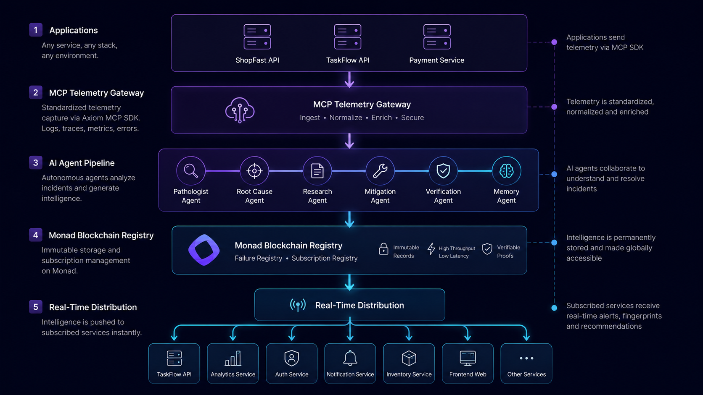

# Architecture

Axiom transforms software failures into collective intelligence.

When one application discovers a new failure, every subscribed service gains the ability to detect and respond to it instantly.

---

## Platform

<p align="center">
  
</p>


## High-Level System Architecture

```text
┌──────────────┐     ┌──────────────┐     ┌──────────────┐
│  Company A   │     │  Company B   │     │  Company C   │
│   ShopFast   │     │   TaskFlow   │     │   PayCore    │
└──────┬───────┘     └──────┬───────┘     └──────┬───────┘
       │  MCP SDK           │  MCP SDK           │  MCP SDK
       ▼                    ▼                    ▼
┌─────────────────────────────────────────────────────────┐
│                 AXIOM TELEMETRY GATEWAY                │
│            (Node.js · Express · WebSockets)            │
└──────────────────────────┬──────────────────────────────┘
                           ▼
┌─────────────────────────────────────────────────────────┐
│              AUTONOMOUS AGENT PIPELINE                 │
│                                                         │
│   Pathologist → Root Cause → Research → Mitigation     │
│                 → Verification → Memory                │
│                                                         │
│      (Embeddings · Vector Search · Multi-Agent LLMs)   │
└──────────────────────────┬──────────────────────────────┘
                           ▼
                ┌────────────────────────┐
                │   Failure Fingerprint  │
                │       Generated        │
                └───────────┬────────────┘
                            ▼
┌─────────────────────────────────────────────────────────┐
│                    MONAD BLOCKCHAIN                    │
│                                                        │
│  ┌────────────────────┐   ┌─────────────────────┐      │
│  │  Failure Registry  │◀─▶│ Subscription Registry│      │
│  │ (Immutable Proof)  │   │ (Real-Time Routing) │      │
│  └────────────────────┘   └─────────────────────┘      │
└──────────────────────────┬──────────────────────────────┘
                           ▼
┌─────────────────────────────────────────────────────────┐
│              REAL-TIME DISTRIBUTION LAYER              │
│                 (WebSockets · Webhooks)                │
└──────┬───────────────────┬───────────────────┬──────────┘
       ▼                   ▼                   ▼
┌──────────────┐    ┌──────────────┐    ┌──────────────┐
│  Company A   │    │  Company B   │    │  Company D   │
│ (Publisher)  │    │ (Recipient)  │    │ (Recipient)  │
│              │    │ ✅ Root Cause │    │ ✅ Root Cause │
│              │    │ ✅ Fix        │    │ ✅ Fix        │
│              │    │ ✅ Confidence │    │ ✅ Confidence │
└──────────────┘    └──────────────┘    └──────────────┘
```

---

## Subscription Matching Engine

Every published fingerprint is evaluated against subscriptions stored on Monad.

Only relevant services receive intelligence.

```text
          New Fingerprint Published
                     │
                     ▼
       ┌─────────────────────┐
       │ Subscription Match  │
       │       Engine        │
       └─────────────────────┘
                     │
                     │
 "Node.js" + "TypeError" + "High Severity"
                     │
       ┌────────┼────────┬────────────┐
       ▼        ▼        ▼            ▼
   ShopFast  TaskFlow  PayCore   ...thousands more
    (alert)   (alert)  (no match)
```

This enables:

* Intelligent routing
* Noise reduction
* Framework-specific alerts
* Cross-company learning at scale

---

## Incident Lifecycle

```text
App          MCP SDK      Axiom Core      Agent Pipeline      Monad        Subscriber
 │              │              │                 │              │               │
 │ Crash        │              │                 │              │               │
 ├────────────▶ │              │                 │              │               │
 │              │ Telemetry    │                 │              │               │
 │              ├────────────▶ │                 │              │               │
 │              │              │ Investigate     │              │               │
 │              │              ├───────────────▶ │              │               │
 │              │              │                 │ Diagnose     │               │
 │              │              │                 │ (6 Agents)   │               │
 │              │              │                 │              │               │
 │              │              │ Fingerprint     │              │               │
 │              │              │◀───────────────┤              │               │
 │              │              │                 │              │               │
 │              │              │ Publish Hash    │              │               │
 │              │              ├──────────────────────────────▶ │               │
 │              │              │                 │              │ Match         │
 │              │              │                 │              │ Subscriptions │
 │              │              │                 │              ├──────────────▶│
 │              │              │                 │              │               │
 │              │              │                 │              │ Root Cause    │
 │              │              │                 │              │ Fix           │
 │              │              │                 │              │ Confidence    │
 │              │              │                 │              │──────────────▶│
 │              │              │                 │              │               │
 │              │              │                 │              │ Real-Time     │
 │              │              │                 │              │ Alert         │
 │              │              │                 │              │──────────────▶│
 │              │              │                 │              │               │
 │              │              │                 │              │      Failure Prevented
 │              │              │                 │              │      Before It Happens
```

---

## Architecture Philosophy

```text
Observe
    ↓
Analyze
    ↓
Fingerprint
    ↓
Publish
    ↓
Distribute
    ↓
Protect
```

**One application's failure becomes another application's immunity.**
